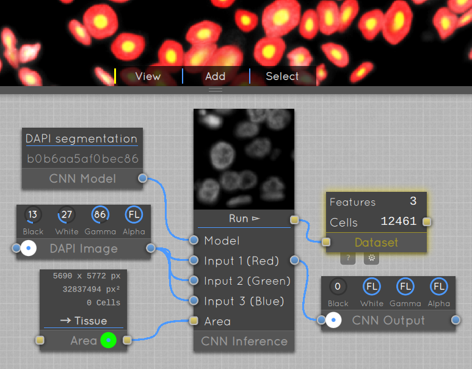

# HistoFlow: Interactive Deep Learning Tool for Cell Segmentation and Analysis

A tool to enable biologists to train machine learning models for their own histo-pathology images.

A short introduction video can be seen here:

Open the **example projects** in the client to learn how to use the software. Have a look at the [Model Application and Training](./User%20Guide:%20Model%20Training%20and%20Application.md) and [Annotation Modes](./User%20Guide:%20Annotation%20Modes.md) User Guides for a detailed textual explanation.

See the [HistoFlow-Models](https://github.com/luminosuslight/pathology-pretrained-models) repository for pre-trained models.

The code is released under the MIT license.

Note: The development name of the tool was _luminosus-microscopy_ which may still appear in the code.

## Client

Windows and macOS binaries are available in the [releases](https://github.com/luminosuslight/pathology-ml-model-training/releases) area at the top right. They already contain all required dependencies.

### Build Requirements

* Win / macOS / Linux (cross-compilation for Android and iOS should work, too)
* Qt 5.14
* QtCreator or qmake

You also need to create an SSL certificate (core/data/luminosus_websocket.cert and core/data/luminosus_websocket.key). Please use the standard commands you can find on the Internet to create those.

### Build Instructions

* `git submodule update --init --recursive`
* open `src/luminosus-microscopy.pro` in Qt Creator, configure and hit the green play button

## Server

### Requirements

* Python 3 and dependencies as listed in [server/requirements.txt](server/requirements.txt) (most notably fast.ai and Flask)
* Nvidia GPU recommended for accelerated training and inference

### Set-up

* copy SSL certificate from client in case you want to use HTTPS
* (optionally) create and activate Conda environment
* change to the `server` directory
* install Python dependencies (e.g. using `conda install --file requirements.txt`)
* run `export FLASK_APP=main.py`
* start the server with `python3 -m flask run --host='::' --port=55712` to listen for IPv6 HTTP requests
* alternatively run `python3 -m flask run --host='::' --port=55712 --cert=luminosus_websocket.cert --key=luminosus_websocket.key` for HTTPS
* enter the IP address of the server in the clients settings, it will connect to it automatically

## Screenshots

The screenshot below shows how a CNN model is applied in the node-based GUI: The 'DAPI Image' with ~10k cells serves as the input for the model. The 'CNN Model' block represents an already trained network. The 'Area' block allows to limit the analysis area. After clicking 'Run', the 'CNN Inference' block prepares the input data (with a preview in the top part of the block), uploads it to the back end and starts the inference. The result is stored in the 'Dataset' block on the right. Under it is the output image of the network that can be used for further post-processing. A snippet of the model output is displayed as an overlay on the DAPI image at the top.

The following screenshot shows the whole user interface. Multiple images and plots can be displayed simultaneously.

