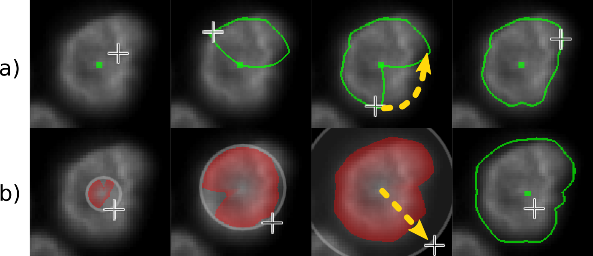

 
# Cell Boundary and Feature Annotation

The integrated annotation tool supports multiple modes of operation with varying levels of support, complement each other for different scenarios. Everything described for cells can also be applied to only the nuclei.

Annotation Modes: (a) Fully Manual and (b) Interactive Watershed:

**Fully manual:** A cell instance is created by clicking on the center of it. The outline is drawn by clicking there again and dragging the mouse on the edge of the cell, see figure (a) above. This can also be used to improve the outline of existing incorrect annotations. Cells can be deleted by a single click in this mode.

**Interactive Watershed:** The user clicks on the center of a cell and opens a circular area around it by dragging the mouse. Within this range, an attempt is made to estimate the outline of the cell with a Watershed inspired algorithm. Unlike the original algorithm it does not flood the area starting from the local minima, but finds the minimum value on a set of radial lines from the center to the edge of the area. The area of the cell is spanned between those points. The user sees the currently estimated outline while moving the mouse, hence the word 'Interactive' in the name, see figure (b) above.

To use this mode, an image channel must first be selected that provides the energy levels for the Watershed algorithm. If the cell nucleus is to be annotated, the DAPI channel will be best suited, since it usually shows a clear demarcation there. 

After two or more cells have been annotated, a simple click on the center of a cell is sufficient if the boundary is clearly visible. In this case, the software iterates over the range from the smallest to the largest existing cell radius, applies the Watershed algorithm described above to all of them and chooses the best fitting outline automatically.

**Region Grow:** If there is already a semantic - but not instance - segmentation available, it will be sufficient to first mark only the cell centers with a single click. In a second step, the outlines of the cells are found by a marker-based region grow algorithm. It either draws a region from the cell centers to the edge of the mask or until the region meets another region. The semantic segmentation makes it therefore faster to annotate the boundaries and is a simple form of machine learning assisted annotation.

**Labels from weak annotations:** It is possible to plot the intensity of a staining per cell and mark all cells above a certain threshold as belonging to a specific category. By clicking on specific instances and overwriting the label, outliers can be fixed manually. This mode is useful to train a classifier based on a staining which is a good predictor for a certain biomarker, but that may not always be available due to time or cost restrictions.
